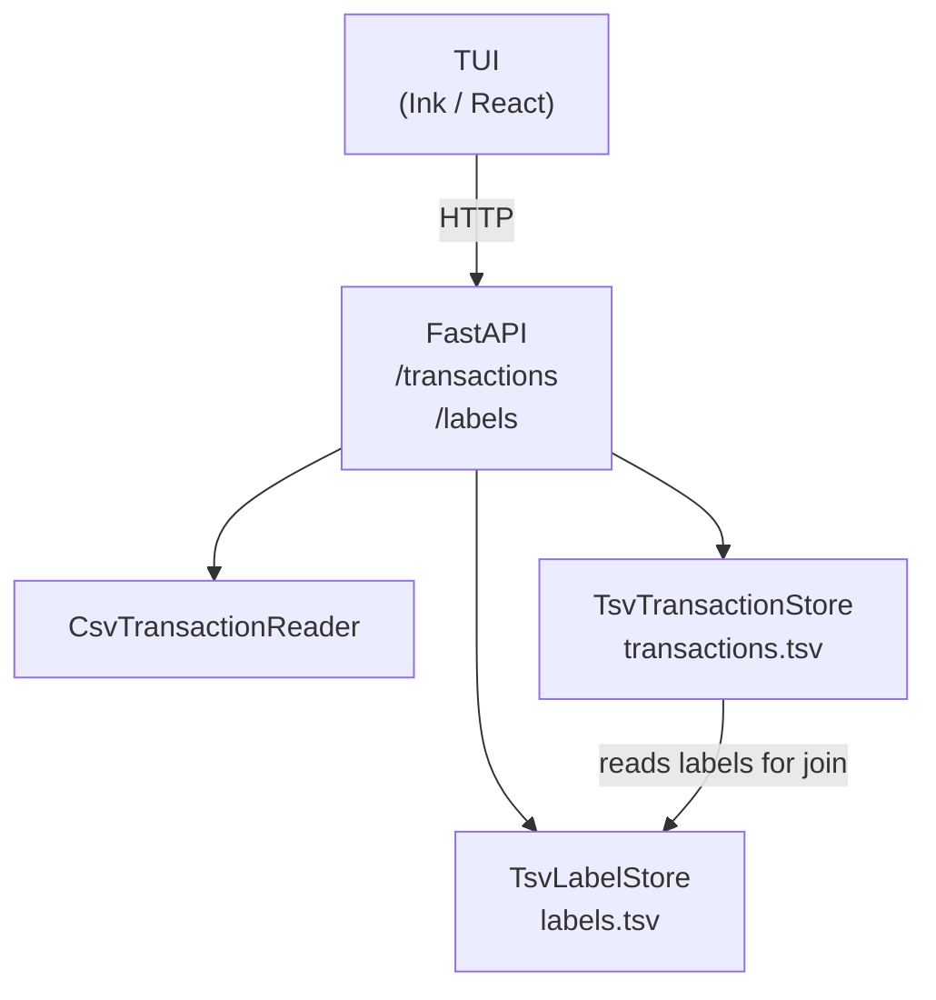

## Project

Personal budget tracker. Import bank CSV exports, label transactions with a 3-tier hierarchy, and analyse spending — all from the terminal.

**Features**
- Upload CSV bank exports (UTF-8 / latin-1)
- Browse, filter, and edit transactions
- 3-tier label hierarchy (group → category → label)
- Analytics window with spending breakdown
- TUI built with Ink/React; backend is FastAPI + TSV file storage

## Git Conventions

- Use conventional commits: feat:, fix:, docs:, refactor:
- Keep subject lines under 72 characters
- Always run tests before committing
- Create feature branches for new work